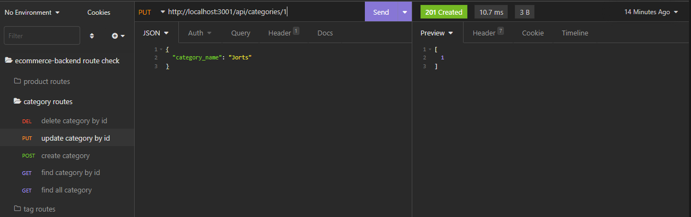
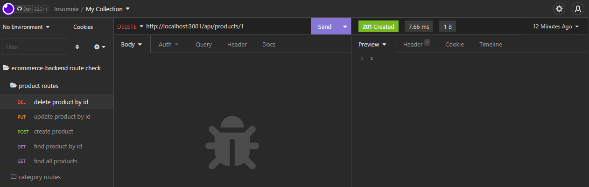
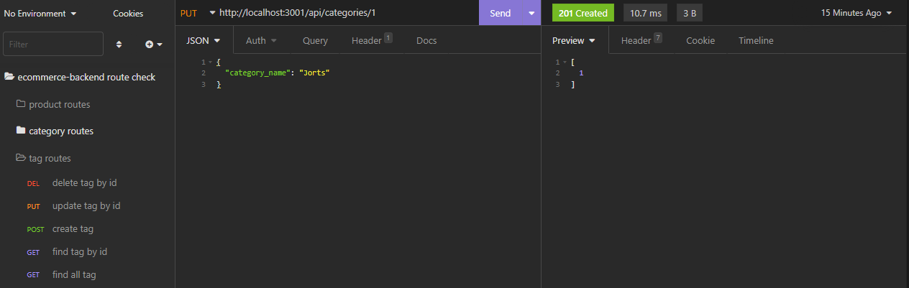

# Ecommerce-Backend

  ## Description
  
  A backend API that allows a developer to retrieve, create, update, and delete shopping items, categories, and tags 
  
  ## Table of Contents 
    
  - [Installation](#installation)
  - [Usage](#usage)
  - [Credits](#credits)
  - [License](#license)
  - [Credits](#credits)
  - [Tests](#tests)
  - [Questions](#questions)
  
  ## Installation
  
  Clone repo, run npm i
   
  ## Usage
  - Run mysql command to initialize connection and creation of database, then run "npm run seed" to generate the seeds, then use npm start from the command line to initialize the server.

  - Use Insomnia or your browser to check responses to ensure they are properly being dealt with
  
  Video link for backend-setup walkthrough: https://drive.google.com/file/d/1Tv25HJDfQI6oNlH3V2uuqgwKIYfso64u/view 

  Video link for insomnia walkthrough: https://drive.google.com/file/d/1omv8m1ArSZv5Yh315-kzIZaxCsEAfN5f/view 
     
  All tested routes are identical, as shown by the following images except for the difference of scpecific route name and request/response body structure:
  
  

  

  
  
  ## Credits
  
  
  
  ## License
  
  

  https://opensource.org/licenses/MIT

  ---
  
  ## Tests
  
  Use insomnia routes as shown in the walkthrough

  ## Questions

  GitHub: https://github.com/MarquisWillis

  Email: mailto:marquiswillis99@gmail.com

  Click mailto link above for further information about this project and/or other concerns

  